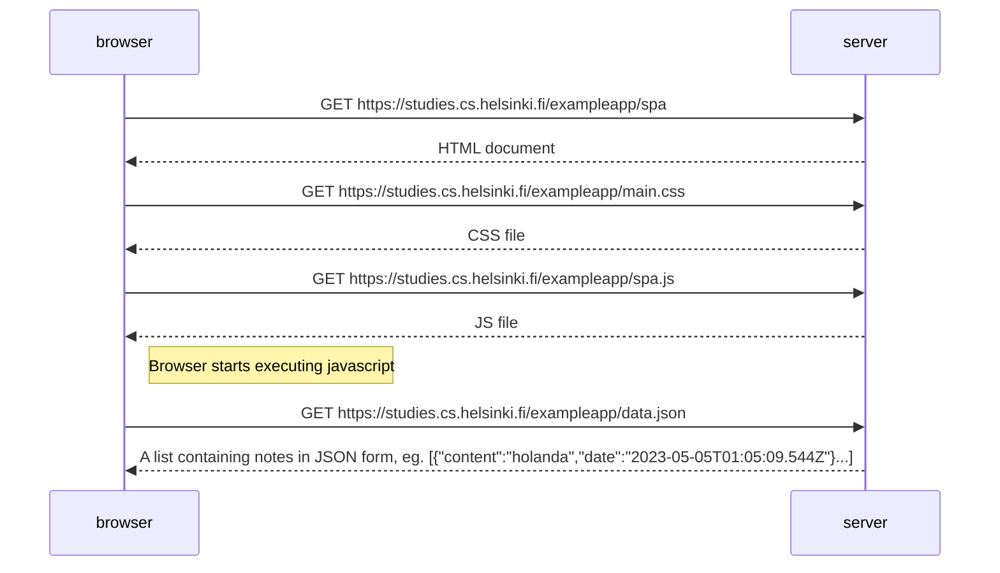

```mermaid

sequenceDiagram
    browser->>server: GET https://studies.cs.helsinki.fi/exampleapp/spa
    server-->>browser: HTML document

    browser->>server: GET https://studies.cs.helsinki.fi/exampleapp/main.css
    server-->>browser: CSS file
    
    browser->>server: GET https://studies.cs.helsinki.fi/exampleapp/spa.js
    server-->>browser: JS file

    Note right of browser: Browser starts executing javascript
    
    browser->>server: GET https://studies.cs.helsinki.fi/exampleapp/data.json
    server-->>browser: A list containing notes in JSON form, eg. [{"content":"holanda","date":"2023-05-05T01:05:09.544Z"}...]
    

```