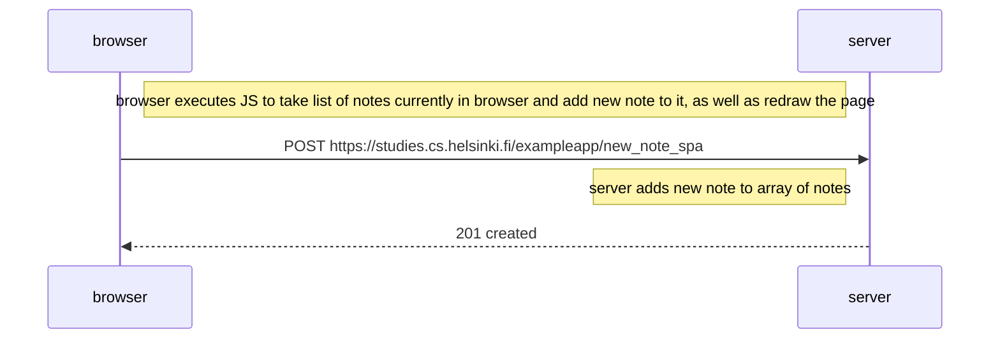

```mermaid
sequenceDiagram
        Note right of browser: browser executes JS to take list of notes currently in browser and add new note to it, as well as redraw the page
        browser->>server: POST https://studies.cs.helsinki.fi/exampleapp/new_note_spa
        Note left of server: server adds new note to array of notes
        server-->>browser: 201 created

```